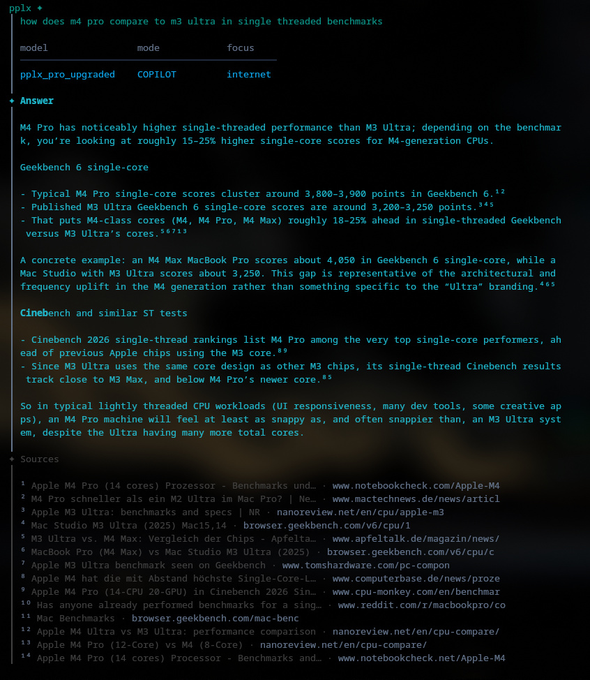

<div align="center">

# pplx

**Perplexity in your terminal.**

[](LICENSE)
[](https://www.typescriptlang.org/)
[](https://bun.sh)

Ask questions, get sourced answers with citations—streamed to your shell.

<br />



<br />

</div>

---

## Overview

This monorepo ships two packages:

| Package                     | Description                                                                     |
| :-------------------------- | :------------------------------------------------------------------------------ |
| [`@pplx/cli`](packages/cli) | Terminal client with streaming output, interactive threads, and model switching |
| [`@pplx/api`](packages/api) | Streaming-first Perplexity API client for Node and Bun                          |

<br />

## Getting Started

### Installation

```bash
bun install
bun run install:dev  # links `pplx` globally
```

### Authentication

Extract session cookies from the Perplexity desktop app:

```bash
pplx --login
```

Or set them manually:

```bash
export PPLX_COOKIES="<your session cookies>"
```

<br />

## CLI

### Quick queries

```bash
pplx "what caused the 2003 northeast blackout"
```

### Focus modes

```bash
pplx -f academic "CRISPR delivery mechanisms 2024"
pplx -f youtube "best mass gainer review"
pplx -f reddit "mass gainer with creatine reviews"
```

### Interactive chat

```bash
pplx chat
```

Chat supports slash commands to control the session:

| Command         | Description                                                |
| :-------------- | :--------------------------------------------------------- |
| `/model <id>`   | Switch models (`claude45sonnet`, `gpt5`, `o3`, etc.)       |
| `/focus <type>` | `internet` · `academic` · `youtube` · `reddit` · `writing` |
| `/mode <mode>`  | `copilot` · `concise`                                      |
| `/recency <r>`  | `day` · `week` · `month` · `year` · `off`                  |
| `/new`          | Start a fresh thread                                       |
| `/exit`         | Quit                                                       |

<br />

## Development

```bash
bun run check    # biome lint + typecheck
bun run fmt      # format
bun run cli      # run CLI in dev mode
```

<br />

## License

MIT
